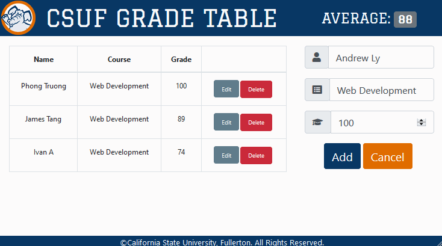

# CSUF - SGT
* Live Demo: __https://sgt.phongtruong.com__


<hr/>

CSUF-SGT is a full-stack, content management system. The app provides users with the ability to add grades to their gradebook, average up the grade, update the student's grade, and delete specific grade from the gradebook. The app was themed after my alma mater, California State University, Fullerton.
## Getting Started
### Initial Setup
1. Fork this repo and clone your fork from the terminal.
```
$ git clone https://github.com/phongoli0/csuf-sgt.git
```
2. Navigate into the cloned directory and install the necessary dependencies.
```
$ npm install
```
3. Start a dev environment with access to Apache2:
    * Check that port is directed to ```3000```
    * Check that the root directory of the server is set to the ```public``` folder
4. Initiate the dev server
```
$ npm run dev
```
5. Go to ```localhost:3000``` and enjoy 😃

## Contributing
Please feel free to fork this repo, make changes, submit pull requests, and send suggestions to ptruong6@outlook.com to make this app better.

## Built With
* Front-End
  * [JavaScript](https://www.ecma-international.org/publications/standards/Ecma-262.htm)
  * [React.js](https://reactjs.org/)
  * [Reactstrap](https://reactstrap.github.io): for desktop and mobile responsiveness
* Back-End
  * [Node.js](https://nodejs.org/en/)

## License
[MIT License](https://opensource.org/licenses/mit-license.php)

[](https://opensource.org/licenses/mit-license.php)

